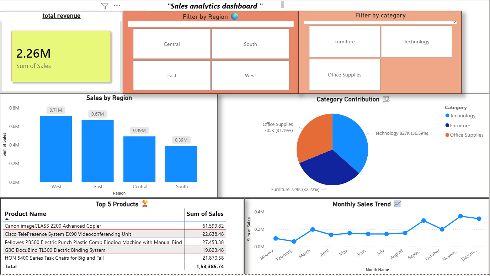

# 📊 Sales Analytics Dashboard

## 📌 Overview
This project is an end-to-end Sales Analytics Dashboard built using Python and Power BI.  
It analyzes sales data to identify trends, regional performance, and top-selling products.

---

## 🛠️ Tools & Technologies
- Python (Pandas, Matplotlib)
- Power BI
- Excel / CSV Data

---

## 📂 Project Structure
sales-analytics-project/
│
├── data/
│ └── cleaned_sales_data.csv
│
├── notebooks/
│ └── sales_analysis.ipynb
│
├── dashboard/
│ └── sales_dashboard.pbix
│
├── dashboard.png
│
└── README.md

## 📊 Dashboard Features

- 💰 Total Revenue Overview  
- 🌍 Region-wise Sales Analysis  
- 🛒 Category-wise Contribution  
- 📈 Monthly Sales Trend  
- 🏆 Top 5 Products Analysis  
- 🎛️ Interactive Filters (Region & Category)  

---

## 📷 Dashboard Preview

---

## 📊 Key Insights

- West region generated the highest revenue  
- Technology category contributed the most sales  
- Sales show a clear monthly trend pattern  
- Top 5 products contribute significantly to total revenue  

---

## 🚀 How to Use

1. Open the `.pbix` file in Power BI Desktop  
2. Use slicers to filter by Region and Category  
3. Analyze trends and insights from visuals  

---

## 🔗 Dataset

Superstore dataset (commonly used for analytics projects)

---

## 👨‍💻 Author

**Gajanan Kshirsagar**  
Aspiring Data Analyst | Power BI | Python  

---

## ⭐ If you like this project

Give it a ⭐ on GitHub and connect with me!
